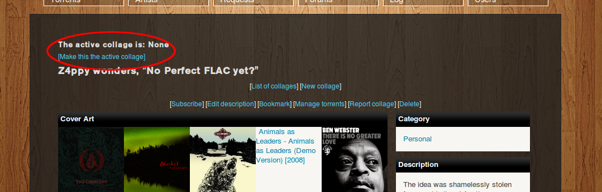
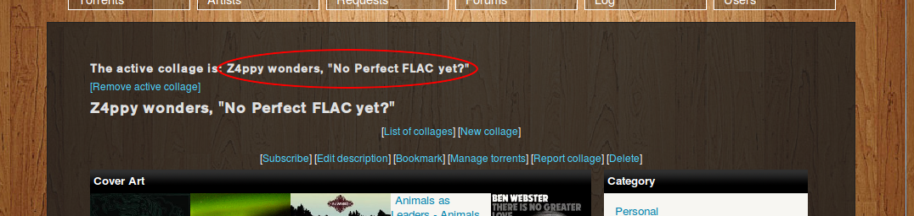

# What.CD :: Collage Building Helper
The Collage Building Helper is a userscript facilitating the creation of collages on What.CD (and potentially other Gazelle-based trackers, though unsupported and untested). You can add or remove torrents to a collage from various pages, including an artist's discography, a torrent group page, the torrent search, notifications and bookmarks. It is compatible with both Firefox/Greasemonkey and Chromium/Tampermonkey.

The script is based on captZEEbo's Collage Building Helper which was deleted from userscripts.org some time ago and ceased to work after the SSL change on 2012-08-23.

## How to use the Collage Building Helper
After installing and browsing to a collage page, you'll notice that the script added two things: a 'Make this the active collage' link and a display of the current active collage (which will be 'None' at first):

After clicking 'Make this the active collage', it will look like this:

You can now add torrents to this collage from various pages, for example an artist page:

Clicking the add icon (eg. next to Elysium) will add that torrent group to the collage and change the icon to a tick (eg. next to Nemesis). Clicking that tick will remove the torrent from the collage again. All torrents already in the collage will get displayed with the tick icon on the pages they appear.

On torrent group pages, it looks like this:

Adding and removing torrents is currently possible from artist pages, torrent search, bookmarks, notifications, torrent group pages, seeding/uploaded/snatched/leeching pages and other collages.

## Thanks
* captZEEbo — for writing the original script
* Momentum Design Lab, ajaxload.info and Yusuke Kamiyamane — for the icons
